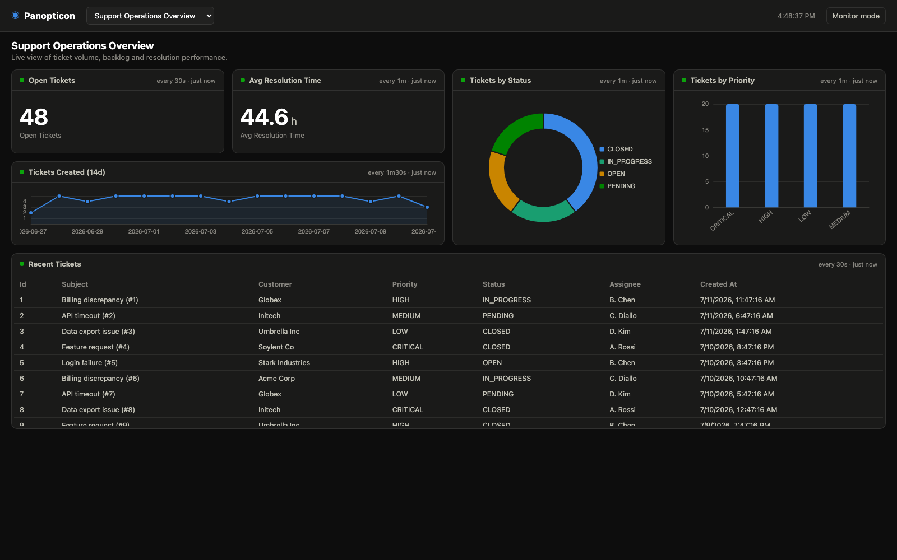
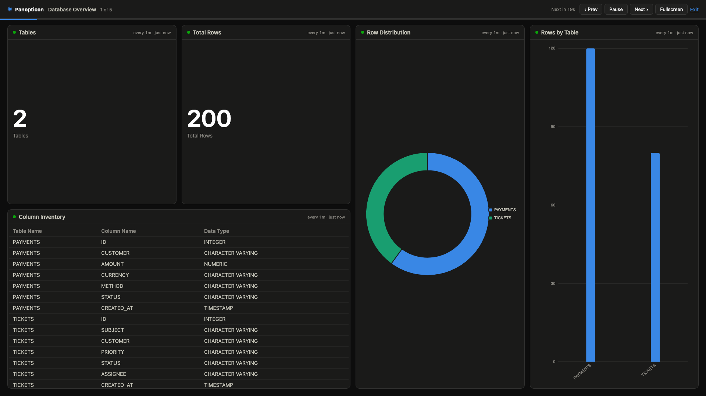
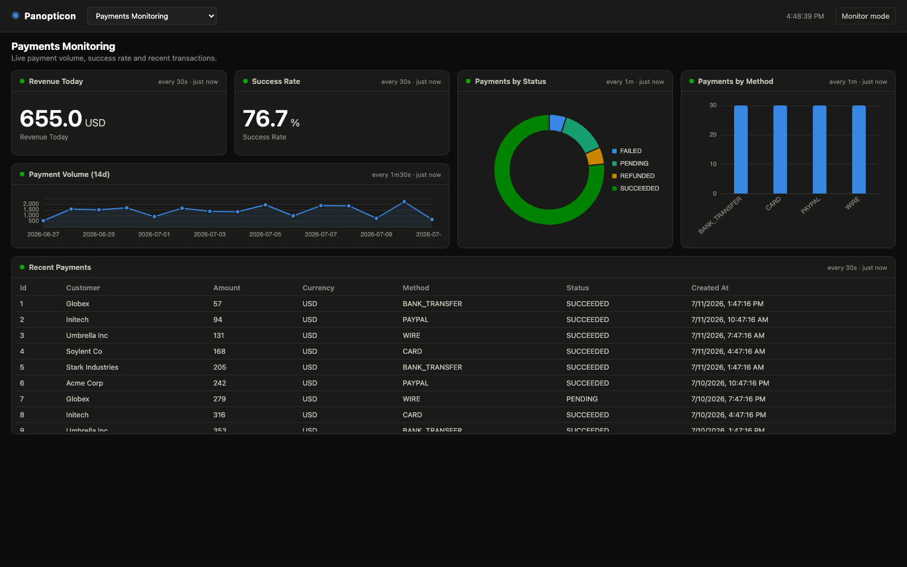
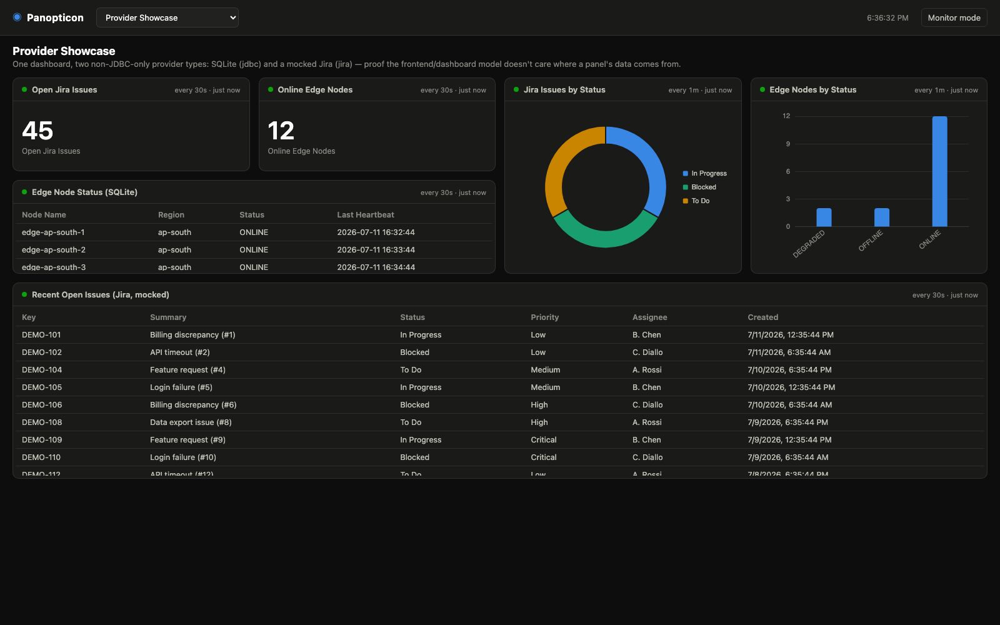

# Panopticon

Panopticon is a self-contained **operational dashboard-as-code** tool for AM/support
teams, not a generic BI tool: dashboards, panels and data definitions are
JSON-defined artifacts, not user-built reports. Data retrieval is
**provider-agnostic** — a panel doesn't know or care whether its data came
from SQL, a REST API, or anything else; every data source type is a plugin
behind one common interface. No JPA/Hibernate, no server-side chart
rendering, no frontend framework/build step — a plain Spring Boot MVC app
serving static assets.

## Screenshots

| Dashboard picker | Monitor mode (1080p wall display) |
|---|---|
|  |  |



A dashboard can also mix providers freely — `provider-showcase` renders
SQLite and mocked-Jira panels side by side:



## Architecture overview

The backend/frontend split is deliberate and enforced by what each layer is
allowed to know:

| Backend owns | Frontend owns |
|---|---|
| Dashboard definitions | Rendering |
| Data definition catalog | Layout |
| Datasource registry | Chart visualization (ECharts) |
| Data provider execution (SQL, Jira, ...) | Refresh polling |
| Validation | Monitor rotation UX |
| Runtime state | |
| Result caching | |

The frontend never talks to a datasource directly, in any form — it only
ever calls `GET /api/dashboards/{id}/panels/{panelId}/data` and renders
whatever tabular JSON comes back. Every data definition/datasource/provider
concern, and the result cache, live entirely in the backend, behind one
interface (`DataProvider`) the frontend has no visibility into.

**Request path**, every time a panel asks for data:

```
Browser (dashboard.js, polling on panel.refresh.intervalSeconds)
  │  GET /api/dashboards/{id}/panels/{panelId}/data
  ▼
DashboardController ─▶ resolves panel.dataRef ─▶ DataEngine.execute(dataId)
                                                      │
                                                      ├─▶ DataRegistry          (dataRef → DataDefinition)
                                                      ├─▶ DataSourceRegistry    (definition.datasource → DataSourceDefinition)
                                                      ├─▶ DataProviderRegistry  (definition.provider → the right DataProvider)
                                                      │        │
                                                      │        ├─ JdbcDataProvider  (SqlGuard, JdbcTemplate, HikariCP)
                                                      │        └─ JiraDataProvider  (MockJiraClient for now)
                                                      │
                                                      ├─▶ DataResultCache  (per-data-id TTL; success + failure both cached)
                                                      └─▶ PanelRuntimeTracker  (success/failure/duration/rowCount, per panel)
```

`DataEngine` never branches on provider type — it resolves a definition, its
datasource, and the matching provider, then calls `provider.execute(context)`
and gets back the same `DataResult` shape no matter which provider ran.
Adding a new data source type means writing one class that implements
`DataProvider`; nothing else in the request path changes.

**Config load path**, once at startup (fail-fast: an invalid config aborts
startup rather than running half-broken):

```
config/dashboards/*.json ─┐
config/data/*.json       ─┼─▶ ConfigLoader ─▶ ConfigValidator ─▶ DashboardRegistry / DataRegistry
application.yml (datasources) ─┘                                  (held in memory for the process lifetime)
```

## Data providers

A `DataProvider` is the plugin contract every data source type implements:

```java
public interface DataProvider {
    String providerType();                    // e.g. "jdbc", "jira"
    boolean supports(DataDefinition definition);
    DataResult execute(DataExecutionContext context);
}
```

Providers are plain Spring `@Component` beans — `DataProviderRegistry`
collects every `DataProvider` bean automatically (constructor-injected as
`List<DataProvider>`) and resolves one by `providerType()`. There's no
dynamic/external plugin loading yet (ServiceLoader, separate JARs, PF4J) —
that's a reasonable next step once this in-process contract has proven
itself with more than two providers, not something to build ahead of need.

| Provider | `providerType()` | Datasource shape | Status |
|---|---|---|---|
| `com.panopticon.data.jdbc.JdbcDataProvider` | `jdbc` | JDBC URL + driver + dialect | Real — H2, SQLite, and (with the right driver/JDBC URL) Oracle |
| `com.panopticon.data.jira.JiraDataProvider` | `jira` | Jira base URL + auth | Mocked — see below |

### The jdbc provider

Owns everything SQL-shaped: building one HikariCP pool per `provider: jdbc`
datasource at startup (including demo schema/seed scripts), the read-only
guard, query timeout/maxRows, and shaping a `ResultSet` into a `DataResult`.
See [SQL read-only guard](#sql-read-only-guard) below.

`dialect` (`generic`/`h2`/`oracle`/`sqlite`) is carried per datasource and
parsed into a `SqlDialect` enum, currently informational — row limiting is
already portable via `Statement.setMaxRows()`, so there's no dialect-specific
SQL to generate yet. It exists as the extension point for when there is one
(e.g. a future pagination clause or identifier-quoting rule).

### The jira provider

Supports three operations: `issue-search` (a table of matching issues),
`issue-count` (a single total), and `issue-count-by-field` (grouped counts).
It's backed entirely by `MockJiraClient`, an in-memory synthetic issue
generator — **no real Jira instance or HTTP call is involved yet.** This is
deliberate: the point of this first pass was proving the provider
abstraction with a second, non-JDBC-shaped data source, not building a Jira
REST client. `MockJiraClient` also does not parse JQL — it recognizes exactly
one thing, a case-insensitive `!= done` substring, enough to make the
bundled demo data definition's "open issues" framing honest without
pretending to be a JQL engine. `baseUrl`/`auth` on a jira datasource are
accepted and carried through config, unused, for a future real
implementation to read.

## Safety notes

Panopticon executes real queries against real datasources on a schedule, on
behalf of anyone who can load a dashboard page — treat data definition
authoring with the same care as any other production data access:

- **Use a genuinely read-only database user** for every jdbc datasource in
  `panopticon.datasources.*`, and set `readOnly: true` there too — it's
  applied at the HikariCP pool level (`Connection.setReadOnly(true)` on every
  borrowed connection), an extra layer under the SQL guard. (The bundled demo
  datasources are `readOnly: false` because they self-seed their own schema/data
  through that same pool at startup — a real, external datasource should
  virtually always be `true`.) The [SQL guard](#sql-read-only-guard) is
  defense in depth, not a substitute for real permissions.
- **Prefer dedicated reporting views over raw tables.** A view can pre-join,
  pre-aggregate, and expose only the columns a dashboard actually needs — so
  even a guard bypass or an overly broad `SELECT *` has nothing sensitive to
  reach.
- **Always set `timeoutMs`** on a data definition (default `10000`). A slow
  or locked query should time out and surface as a panel error, not hang a
  connection-pool slot indefinitely.
- **Always set `maxRows`** (default `1000`). This bounds both the JDBC
  driver (`Statement.setMaxRows`) and the row-shaping loop, so a query that
  unexpectedly matches millions of rows can't OOM the process or blow up a
  payload to the browser.
- **Avoid expensive queries.** Aggregate (`GROUP BY`, `COUNT`, `SUM`) in the
  database rather than pulling raw rows for the frontend to summarize; add a
  `WHERE` clause bounding the time range for anything trend-shaped (see the
  sample data definitions' `DATEADD(...)` filters); make sure the columns you
  filter or join on are indexed. `cacheTtlSeconds` (default `10`) only
  protects against *repeated* hits within the TTL window — it does nothing
  for a query that's expensive on every single execution.

## Requirements

- Java 21
- Maven 3.9+

## Run it

```bash
mvn spring-boot:run
```

or build a jar and run it directly:

```bash
mvn clean package
java -jar target/panopticon.jar
```

The app starts on **http://localhost:8080** (override with `--server.port=<port>`
if that's taken). No external database is required — it ships with an
in-memory H2 datasource, an in-memory SQLite datasource, and a mocked Jira
datasource, all seeded/generated on startup, so every sample dashboard works
out of the box:

- `http://localhost:8080/` — dashboard picker + live panels
- `http://localhost:8080/monitor.html` — fullscreen rotation between dashboards
- `http://localhost:8080/actuator/health` — liveness/readiness;
  `/actuator/metrics/panopticon.data.execution` and
  `/actuator/metrics/panopticon.cache` expose per-data-id execution timings
  and cache hit/miss/negative-hit counters (Micrometer — plug in a registry
  like `micrometer-registry-prometheus` if you need a scrape endpoint)

### Choosing which dashboards load: `--dashboards` / `--data`

By default dashboards/data definitions come from `config/dashboards` and
`config/data` (see [Configuration model](#configuration-model)). Both can be
overridden at startup with a comma-separated list of locations, where each
entry is either a single `.json` file or a directory of them:

```bash
java -jar target/panopticon.jar \
    --dashboards=/srv/dashboards,extra/one-off-dashboard.json \
    --data=/srv/data
```

Useful for pointing one binary at different dashboard sets per environment,
or mixing a shared directory with a couple of one-off files. Being ordinary
Spring properties, they also work as YAML (`dashboards: [...]`) or env vars.

### Recording executed data: `--recording`

```bash
java -jar target/panopticon.jar --recording=recordings
```

records every *fresh* data execution (cache hits are replays and are not
re-recorded) as one JSON line — data id, datasource, provider, status,
timing, full columns/rows payload — to a daily-rolling
`recordings/panopticon-YYYY-MM-DD.jsonl`, written on a background thread so
panel serving never waits on disk. Equivalent long form:
`panopticon.recording.enabled: true` + `panopticon.recording.directory`.

The file is reusable data, not just a log. To load it into a database table:

```bash
# once, by hand, against the target database:
#   run src/main/resources/db/recording/recording_table_v1.sql
java -jar target/panopticon.jar \
    --import-recording=recordings/panopticon-2026-07-13.jsonl \
    --import-datasource=demo-h2 \
    --import-table=panopticon_recordings \
    --spring.main.web-application-type=none
```

This runs as a one-shot CLI (exit 0/1) instead of serving dashboards. The
importer deliberately **never creates or alters tables**: the target table
must already exist at the schema version it expects (`db/recording/` ships
the versioned create script plus an upgrade template), the datasource must
be configured `read-only: false` (writes go through a dedicated plain JDBC
connection, never the read-only query pools), and re-importing the same file
is idempotent — already-imported lines are skipped via the
`(source_file, source_line)` primary key.

### Docker

```bash
docker build -t panopticon .
docker run -p 8080:8080 -v ./config:/app/config panopticon
```

Multi-stage build (Maven → JRE-only runtime); the sample `config/` is baked
in as a default and can be replaced with a volume mount as above.

### Development & testing

```bash
mvn test     # unit tests (surefire: *Test classes)
mvn verify   # + the production-like integration suite (failsafe: *IT classes)
```

`mvn verify` boots real Spring contexts against temp-file SQLite databases
with a background traffic simulator (five writer threads with weighted state
machines), and covers realtime data validation, fault injection (missing/
empty/schema-drifted/locked tables), concurrency/cache-collapse stress, and
the recording/import round-trip. Fixtures live under `it-config/`. JaCoCo
writes a merged coverage report to `target/site/jacoco/index.html`; CI
(GitHub Actions, `.github/workflows/ci.yml`) runs `mvn verify` on every
push/PR.

## Sample dashboards

Six dashboards ship under `config/dashboards/`, backed by 30 data
definitions under `config/data/`:

| Dashboard | What it shows | Provider(s) |
|---|---|---|
| `support-ops` | Open tickets, avg resolution time, status/priority breakdowns, a 14-day volume trend, recent tickets | jdbc (H2) |
| `team-workload` | Critical backlog, open-ticket distribution by priority, workload by assignee | jdbc (H2) |
| `payments-monitoring` | Revenue today, success rate, payments by status/method, a 14-day volume trend, recent payments | jdbc (H2) |
| `db-overview` | The datasource's own schema — table/row counts and column inventory, read live from `information_schema` | jdbc (H2) |
| `query-performance` | Ticket SLA view — resolution-time distribution, breaches, avg resolution by priority, slowest resolutions | jdbc (H2) |
| `provider-showcase` | Edge-node status (SQLite) and open-issue breakdowns (mocked Jira), side by side | jdbc (SQLite) + jira |

`db-overview` is worth calling out on its own: its queries aren't against
app tables at all, they're against H2's `information_schema` — showing the
jdbc provider can be pointed at a database's own metadata just as easily as
at application data. `support-ops` and `team-workload` are also the two
dashboards left on the legacy `queryRef` panel field (see
[Adding a dashboard](#adding-a-dashboard)), proving that field still works
unchanged; every other dashboard uses the current `dataRef`.

## Configuration model

Three things are configured independently, and wired together by reference —
a data definition is never duplicated inside a dashboard/panel definition:

| What | Where | Referenced by |
|---|---|---|
| Datasources | `application.yml` (`panopticon.datasources.*`) | `DataDefinition.datasource` |
| Data definitions | `config/data/*.json` (one per file) | `PanelDefinition.dataRef` |
| Dashboards | `config/dashboards/*.json` (one per file) | — |

Both `config/data` and `config/dashboards` directories are read from disk
(not the classpath) at startup — paths are configurable via
`panopticon.config.dashboards-path` / `panopticon.config.data-path`, relative
to the working directory by default, or overridden entirely with the
[`--dashboards` / `--data` startup flags](#choosing-which-dashboards-load---dashboards----data). **If the config is invalid the app fails
to start** (unsupported provider type, unknown datasource, missing SQL for a
jdbc definition, missing operation for a jira definition, duplicate ids,
rejected SQL, etc.) rather than starting half-broken; the startup log names
the problem.

### Adding a datasource

Add an entry under `panopticon.datasources` in `application.yml`, with a
`provider` matching a registered `DataProvider` (`jdbc` or `jira` today).
Only the bundled demo datasources use `init-schema`/`init-data` (they
populate their own in-memory schema once at startup):

```yaml
panopticon:
  datasources:
    reporting:
      provider: jdbc
      driver-class-name: oracle.jdbc.OracleDriver
      jdbc-url: "jdbc:oracle:thin:@//host:1521/service"
      username: report_ro
      password: "${REPORTING_DB_PASSWORD}"
      dialect: oracle
      read-only: true

    support-jira:
      provider: jira
      base-url: "https://jira.example.com"
      auth:
        type: bearer
        token: "${JIRA_TOKEN}"
```

See [Safety notes](#safety-notes) above before pointing a jdbc datasource at
a real database. `support-jira` above would resolve today too — but see
[The jira provider](#the-jira-provider): it would still be served from the
in-memory mock, since there's no real HTTP client behind `JiraDataProvider` yet.

### Adding a jdbc data definition

One JSON file per data definition under `config/data/`:

```json
{
  "id": "kpi-open-tickets",
  "name": "Open ticket count",
  "provider": "jdbc",
  "datasource": "demo-h2",
  "sql": "SELECT COUNT(*) AS open_tickets FROM tickets WHERE status <> 'CLOSED'",
  "timeoutMs": 5000,
  "maxRows": 1,
  "cacheTtlSeconds": 10
}
```

`timeoutMs` (default `10000`), `maxRows` (default `1000`) and
`cacheTtlSeconds` (default `10`) are all optional — but see
[Safety notes](#safety-notes) for why you should set the first two
deliberately rather than rely on the default for anything but a quick trial.

Only `SELECT`/`WITH` statements pass the read-only guard — see
[SQL read-only guard](#sql-read-only-guard) below for exactly what's rejected
and why it's not a substitute for real database permissions. Column aliases
are lower-cased before reaching the frontend, so panel `options` can always
refer to them in lower case regardless of how the underlying database folds
identifiers.

### Adding a jira data definition

```json
{
  "id": "jira-open-issues-by-status",
  "provider": "jira",
  "datasource": "demo-jira",
  "operation": "issue-count-by-field",
  "jql": "project = DEMO AND statusCategory != Done",
  "groupBy": "status",
  "timeoutMs": 5000,
  "maxRows": 20
}
```

`operation` is required and must be one of `issue-search`, `issue-count`,
`issue-count-by-field`. `groupBy` (default `status`) only matters for
`issue-count-by-field`; `fields` (an array — `key`/`summary`/`status`/
`priority`/`assignee`/`created`, default: all of them) only matters for
`issue-search`, letting you narrow which columns a table panel gets, the
same way `options.columns` narrows what a table panel *displays*. See
[The jira provider](#the-jira-provider) for what's real here and what isn't.

### Result caching (all providers)

Results are cached **by data id** for `cacheTtlSeconds` (default `10`, `0`
disables caching for that definition) — this lives in `DataEngine`/
`DataResultCache`, above any individual provider, so it applies the same way
whether a definition is jdbc, jira, or a future provider. If two panels —
even on different dashboards, even backed by different providers in
principle — reference the same `dataRef`, a burst of concurrent refreshes
collapses into a single provider execution. `generatedAt` in the response
reflects when the data actually was fetched, so the frontend always shows
true data age even on a cache hit.

**A failing execution is cached too**, for the same TTL as a success.
Without this, a datasource/upstream outage would defeat the entire point of
caching: every viewer's refresh would re-hit the already-struggling provider
instead of being collapsed like a healthy one is. Every request during that
window gets the same error immediately, and the next attempt after the TTL
expires gets to try again for real.

### Adding a dashboard

One JSON file per dashboard under `config/dashboards/`. `grid`/`gridColumns`
follow CSS Grid's 1-based row/column numbering; `refresh` controls how often
the frontend re-fetches that panel's data:

```json
{
  "id": "support-ops",
  "title": "Support Operations Overview",
  "accentColor": "#c98500",
  "gridColumns": 12,
  "rotation": { "durationSeconds": 20, "enabled": true },
  "panels": [
    {
      "id": "kpi-open",
      "title": "Open Tickets",
      "type": "stat",
      "dataRef": "kpi-open-tickets",
      "grid": { "row": 1, "col": 1, "rowSpan": 1, "colSpan": 3 },
      "refresh": { "intervalSeconds": 30, "enabled": true },
      "options": { "valueField": "open_tickets", "format": "number" }
    }
  ]
}
```

`accentColor` (optional, hex like `#3987e5` or `#abc`, validated at load
time) tints the page background with a bottom-to-top gradient wash in that
color — panel surfaces are never tinted, so chart/text contrast is
unaffected. Give each environment's dashboards a different accent (say, blue
for dev, amber for prod) and they become distinguishable at a glance, which
is exactly what a wall display cycling through environments needs.

`dataRef` is the current field name. The older `queryRef` name (from before
the Query → Data rename) is still accepted as a fallback — if `dataRef` is
absent, `queryRef` is used instead — specifically so existing dashboard JSON
doesn't have to change to keep working; `support-ops.json`/`team-workload.json`
in this repo are still on `queryRef`, unmodified, as a live example.

`options` is deliberately a loose map — it's the one place panel-type-specific
rendering hints live, since each chart type only needs 2-3 fields:

| Panel type | Required `options` keys | Optional |
|---|---|---|
| `stat` | `valueField` | `format` (`number`\|`decimal`), `unit` |
| `table` | — | `columns` (array; omit to show every column the data definition returns) |
| `bar` | `xField`, `yField` | `seriesName` |
| `line` | `xField`, `yField` | `seriesName` |
| `donut` | `labelField`, `valueField` | — |

`/api/config/validate` (and startup) reject a panel missing its type's required
`options` keys, or a `grid` position that's out of bounds for the dashboard's
`gridColumns`.

Validate or apply a config edit without restarting the app:

```bash
curl -X POST http://localhost:8080/api/config/validate   # dry run: report errors only
curl -X POST http://localhost:8080/api/config/reload     # apply, if (and only if) valid
```

`validate` re-reads the effective config locations from disk and reports
errors without touching the running app. `reload` does the same load +
validation and, only when fully valid, atomically swaps the live registries
(and clears the result cache, since a definition may have changed under the
same id) — an invalid config returns **400 with the validation errors and
changes nothing**, so a bad edit can never take down a running wall display.

## REST API

| Method | Path | Purpose |
|---|---|---|
| GET | `/api/dashboards` | List dashboards (summary: id/title/description/panel count) |
| GET | `/api/dashboards/{id}` | Full dashboard definition (panels, grid, refresh policy) |
| GET | `/api/dashboards/{id}/panels/{panelId}/data` | Execute the panel's data definition, return tabular JSON |
| GET | `/api/runtime/panels` | Last success/failure, duration, row count per panel |
| POST | `/api/config/validate` | Dry-run validation of the config as it sits on disk |
| POST | `/api/config/reload` | Validate and, if fully valid, hot-swap the running config (400 + errors otherwise, nothing changes) |
| GET | `/actuator/health` | Liveness/readiness |
| GET | `/actuator/metrics/{name}` | Micrometer meters, incl. `panopticon.data.execution` and `panopticon.cache` |

This surface is provider-agnostic and unchanged by which provider backs a
given panel — a SQLite-backed panel and a Jira-backed panel are indistinguishable
to a client of this API. Panel data responses are shaped as:

```json
{
  "columns": [{ "name": "priority", "type": "CHARACTER VARYING" }],
  "rows": [{ "priority": "HIGH" }],
  "generatedAt": "2026-07-10T21:08:33.118Z",
  "executionTimeMs": 7,
  "rowCount": 4,
  "status": "OK",
  "errorMessage": null
}
```

`status`/`errorMessage` are populated on every `DataResult` a provider builds
(so `DataEngine` and the cache can key off them uniformly), but a
`status: "ERROR"` result never actually reaches this endpoint's response body
as-is — `DataEngine` turns it into a thrown exception first, so a failed
panel still surfaces as a non-2xx response with an `{error, message,
timestamp}` body, exactly as before this endpoint gained the two new fields.

`/api/runtime/panels` returns one entry per panel that has been requested at
least once since the process started:

```json
[
  {
    "dashboardId": "support-ops",
    "panelId": "kpi-open",
    "dataRef": "kpi-open-tickets",
    "lastSuccess": "2026-07-11T14:32:23.587Z",
    "lastFailure": null,
    "lastDurationMs": 7,
    "lastError": null,
    "rowCount": 1
  }
]
```

`lastSuccess`/`lastFailure` are independent and both "sticky": a success
doesn't clear a prior failure's `lastError`, and a failure doesn't clear
`lastDurationMs`/`rowCount` from the last successful run — so a panel that's
currently erroring still shows what it looked like when it last worked,
alongside what's wrong now.

## Project structure

```
src/main/java/com/panopticon/
├── model/       Dashboard/panel/data-definition domain records
├── config/      Datasource + config-path properties, registry wiring
├── loader/      JSON config loading and cross-reference validation
├── registry/    In-memory lookups (dashboards, data definitions, datasources)
├── data/        DataProvider SPI, DataProviderRegistry, DataEngine, DataResultCache
│   ├── jdbc/    JdbcDataProvider, SqlGuard, SqlDialect
│   ├── jira/    JiraDataProvider, MockJiraClient
│   └── recording/  DataRecorder (JSONL), RecordingImporter + one-shot import runner
├── runtime/     Per-panel refresh-health tracking
└── api/         REST controllers + error handling

src/main/resources/
├── static/      Frontend (index.html, monitor.html, css/, js/)
└── db/
    ├── mock/    H2 demo schema + seed data (tickets, payments)
    ├── sqlite/  SQLite demo schema + seed data (edge_nodes)
    └── recording/  Versioned DDL for the recording import table (v1 + upgrade template)

config/
├── dashboards/  6 sample dashboards — see "Sample dashboards" above
└── data/        30 sample data definitions backing them

it-config/       Test-only dashboards/data for the production-like integration suite
src/test/        Unit tests (*Test) + integration suite (*IT) — see "Development & testing"
docs/screenshots/  Images embedded in this README
```

## Frontend

Plain HTML/CSS/JS ES modules (no build step) served from `static/`, using
[Apache ECharts](https://echarts.apache.org/) (vendored locally in
`static/js/vendor/`, no CDN dependency) for bar/line/donut charts and CSS Grid for
layout. `js/dashboard.js` is the shared rendering engine used by both the picker
page and monitor mode; each panel fetches and re-renders independently on its own
`refresh.intervalSeconds`, with a status dot (ok/error/pending), a "how often /
how recently" label, a loading state, and an isolated per-panel error state
(one panel failing never affects its siblings). None of this changed with
the provider refactor — the frontend consumes the same tabular JSON
regardless of which provider produced it, and never sees a `dataRef`/
`queryRef` field at all (that's resolved entirely server-side).

Monitor mode (`/monitor.html`) rotates through dashboards whose
`rotation.enabled` is true, showing each for its own `rotation.durationSeconds`,
with a dashboard-position indicator ("2 of 6"), a countdown to the next
rotation, pause/prev/next controls (also bindable via space/←/→), a real
Fullscreen API toggle (`F`), and a layout that stretches panels to fill the
screen edge-to-edge instead of leaving dead space below a fixed row height.

Theming: a header button on both pages cycles **auto → light → dark**
(persisted in `localStorage`). Auto — the default — follows time of day
(light 07:00–19:00, dark otherwise), re-checked periodically so a wall
display spanning the boundary switches without a reload. Panel polling and
monitor rotation pause automatically while the tab is hidden and resume
(with an immediate refresh) when it's shown again.

## SQL read-only guard

`SqlGuard` (used only by the jdbc provider) rejects any statement that isn't
a single `SELECT`/`WITH`, and separately rejects the keywords `insert`,
`update`, `delete`, `merge`, `drop`, `alter`, `truncate`, `grant`, `execute`,
`call`, `begin`, `commit`, `rollback` (plus a few more: `create`, `revoke`,
`exec`) appearing anywhere in the statement as SQL keywords — string
literals and comments are stripped before the keyword scan so they don't
cause false positives/negatives.

**This is a basic safety layer, not a complete SQL security system.** It is a
keyword blacklist plus a `SELECT`/`WITH`-only allowlist, checked against
straightforwardly-formatted SQL — it is not a full parser and could in
principle be defeated by SQL it doesn't anticipate. Real deployments must
still connect through a genuinely **read-only database user**, and preferably
point queries at **dedicated reporting views** rather than raw tables, so that
even a guard bypass has nothing destructive or sensitive to reach. The guard
exists to catch authoring mistakes early and add defense in depth — never as a
substitute for real database permissions. See [Safety notes](#safety-notes).

## Known limitations (by design, for this MVP)

- No auth — this is meant to run inside a trusted network/VPN for an internal team.
- The Jira provider is mock-only — see [The jira provider](#the-jira-provider). No real HTTP call happens yet.
- No dynamic/external plugin loading — providers are compiled-in Spring beans, not JARs discovered at runtime. See [Data providers](#data-providers).
